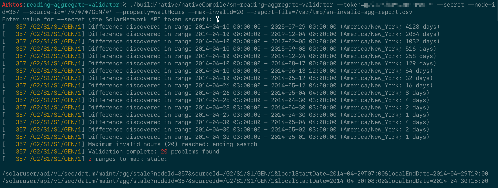
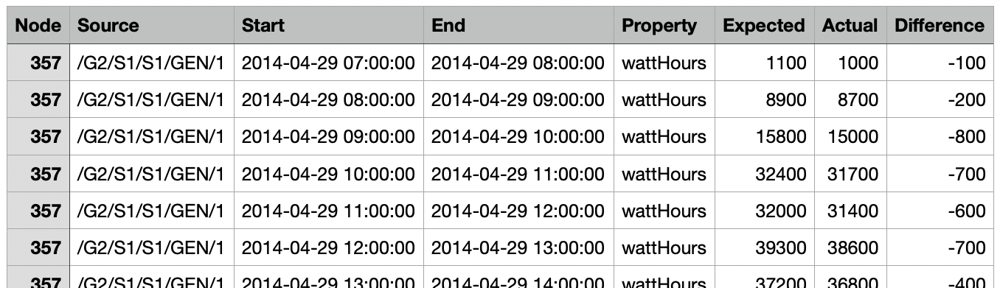

# SolarNetwork Reading Aggregate Validation Tool

This project contains a command line (CLI) tool for analyzing SolarNetwork cached aggregate reading
values, comparing them to on-the-fly reading calculations to look for differences. If differences
are found, the tool generates a detailed report and can even submit "reprocessing" requests to
SolarNetwork, to get the differences eliminated.

Normally there should not be any differences between the raw datum stream data and the cached
aggregates SolarNetwork automatically maintains. However, over time anomalies can creep in
inadvertently, making different views on the same data appear to be inconsistent.



# How it works 

The tool works by querying datum streams (unique node + source ID combinations) for a `Difference`
style reading over all available time in the stream. It then compares that value to an _aggregate
rollup_ `Difference` reading for the same time period. The results should be identical. If not, the
tool splits the time range in half and repeats the process on each half, in order to narrow down the
precise time range the difference occurs in. For each split time range with a difference, it keeps
going, splitting the time range in half again, until it reaches the specific **hours** where
differences occur.

Once the specific inconsistent hours have been identified, the tool produces a spreadsheet report
that details what it found:



Additionally, the tool prints out SolarUser API calls that can be used to mark the inconsistent
hours for "reprocessing". Once reprocessing has been completed, the inconsistencies should be
resolved. Alternatively the tool can submit the reprocessing requests directly for you with the
`--mark-stale` option.

# Use

The tool is available in two styles:

1. an executable Java JAR
2. a native binary

The native binary you can run directly, without needing Java to be installed. The JAR requires you
to have Java 21+ installed on your system. To execute the JAR, run like this:

```sh
# execute JAR version
java -jar sn-reading-aggregate-validator-1.0.0.jar [options here]
```

## Example

The following uses 4 tasks to validate all `/**/GEN/*` datum streams, automatically re-process the
found differences (up to 500 per stream), and generate a report to a file named
`sn-invalid-agg-report.csv`. It will wait at most 2 hours for all streams to be validated.

```sh
sn-reading-aggregate-validator \
  --token=XXXYYYZZZ \
  --secret \
  --property=wattHours \
  --max-invalid=500 \
  --max-wait=PT2H \
  --threads=4 \
  --source-id='/**/GEN/*' \
  --report-file=sn-invalid-agg-report.csv \
  --mark-stale
```

## Typical process

Using this tool follows this general process, assuming the `--mark-stale` option is used to 
automatically submit "mark stale" requests to SolarNetwork:

1. Run validation on a stream.
2. If differences are discovered, specific time ranges will be submitted to SolarNetwork for
   reprocessing.
3. Wait a bit for SolarNetwork to fully reprocess all aggregations, then re-validate the stream.

In step 3, the amount of time to wait depends on how many, and the overall length of, time ranges 
are submitted to SolarNetwork for processing. SolarNetwork will process hour-level aggregations,
then day aggregations, and finally month aggregations in batches, spread over time.

## Limiting the scope of invalidations

You can use the `--max-invalid=N` option to limit the number of differences before stopping the
analysis of a stream. The tool will output a message if this limit is reached, for example:

```
[   123 /AA/BB/CC/GEN/1] Maximum invalid hours (250) reached: ending search
```

Simply re-run the tool with the same options to continue the validation (after waiting for the 
previously submitted invalidations to reprocess).

## Compensating for higher-level aggregation differences

For large sets of changes, if you try to re-validate a stream the tool might discover that the
month-level aggregations still have differences but lower-level aggregations do not. **Usually**
this means SolarNetwork has not finished processing the higher-level aggregations, and you should
wait a bit longer before re-validating the stream. It is also possible (although the chances are
small) that higher-level aggregations are invalid but the lower-level aggregations "beneath" them
are OK. To help with this possibility the `--compensate-higher-agg` option can be specified. That
will make the tool submit sets of time ranges for reprocessing that span time periods where the
higher-level aggregation shows differences but its corresponding lower-level aggregations do not.

For example imagine a month-level aggregation range for January - March shows a difference, but no
day-level differences are discovered for that same period. When `--compensate-higher-agg` is
specified, the tool will generate one invalid hour for each of January, February, and March. This
has the effect of getting those month aggregations reprocessed, hopefully resolving the difference.


# Options

Run the tool with `-h` or `--help` to display all the available options.

## Authentication options

| Option | Description |
|:-------|:------------|
| `-p N` `--secret=N` | The SolarNetwork API token secret for authentication. Can omit the value to be prompted for the password. |
| `-u N` `--token=N` | The SolarNetwork API token for authentication. Must be a **User** token if `--mark-stale` is specified. |

## Datum stream options

You can target any number of datum streams for validation, limited by those that are available
to the API token you use. You must provide the source IDs of the streams to validate with the
`--source-id=` option. You can then limit those streams to just those matching specific node IDs
with the `--node-id=X` option.

| Option | Description |
|:-------|:------------|
| `-node N` `--node-id=N` | An optional node ID to limit validations to, or comma-delimited list of node IDs. |
| `-source` `--source-id=N` | A source ID to validate, or comma-delimited list of source IDs. Wildcard patterns are allowed. |
| `-prop N` `--propery=N` | An **accumulating** datum property name to validate, or comma-delimited list of property names. |

## Action options

| Option | Description |
|:-------|:------------|
| `-i` `--incremental-mark-stale` | Mark stale (or report) immediately after each stream's validation completes. Otherwise wait for all streams to finish processing before marking them stale. |
| `-m` `--mark-stale` | Use the `/datum/maint/agg/stale` to mark time ranges with discovered differences as "stale". |
| `-n` `--dry-run` | Do not actually submit any changes to SolarNetwork. |
| `-r N` `--report-file=N` | A file name to generate a CSV report to, of all invalid time ranges discovered. |
| `--compensate-higher-agg` | Compensate for differences found in higher aggregation levels but not corresponding lower aggregation levels, by treating a covering set of hours as invalid. |
| `--generate-reset-datum-min-gap=N` | A minimum amount of time gap to consider creating a reset datum auxiliary record for, when `--compensate-higher-agg` is also enabled. A reasonable starting value for this is 365 days to account for SolarNetworks 1 year tolerance for reading differences. Specify as an ISO period form like `PT365D` (365 days). |

## Other options

| Option | Description |
|:-------|:------------|
| `-j N` `--threads=N` | Number of streams to validate concurrently. |
| `-h` `--help` | Display help information. |
| `-o N` `--min-days-offset=N` | The minimum number of days offset from today to allow validation. Defaults to `5`. |
| `-R` `--newest-to-oldest` | Process data in a newest-to-oldest (reverse time) fashion. |
| `-v` `--verbose` | Increase verbosity of output. Can specify multiple times to increase verbosity even more. |
| `-w N` `--max-wait=N` | A maximum amount of time to run the validation, in ISO period form like `PT10M` for 10 minutes (the default). |
| `-X N` `--max-invalid=N` | The maximum number of invalid ranges, per stream, to allow before stopping, or `0` for no limit (the default). |
| `--http-trace` | Log HTTP exchanges. Must also configure the `net.solarnetwork.http.REQ` and/or `net.solarnetwork.http.RES` logger levels to `TRACE`. |

# Logging

Logging can be enabled by creating an `application.yml` file in your working directory. You can then
configure standard [Spring Boot Logging][logging-conf] settings. For example
if you would like HTTP exchange traces, add the `--http-trace` option and then configure logging
something like this:

```yaml
logging:
  file.name: "/var/tmp/sn-reading-aggregate-validator.log"
  level:
    net.solarnetwork.http: "TRACE"
  threshold:
    console: "INFO"
    file: "TRACE"
```

# Building from source

To build the executable JAR application from source, run:

```sh
# Unix
./gradlew build -x test

# Windows
.\gradlew.bat build -x test
```

The application will be built to `build/libs/sn-reading-aggregate-validator-VERSION.jar`.

## Building the native binary

To build the native binary, you must have the [GraalVM][graalvm] version 21+ or later installed.
Then add `GRAALVM_HOME` to your environment. For example in `sh`:

```sh
# macOS install
export GRAALVM_HOME=/Library/Java/JavaVirtualMachines/graalvm-21.jdk/Contents/Home
```

Then you can run:

```sh
# Unix
./gradlew nativeCompile

# Windows
.\gradlew.bat nativeCompile
```

The native binary will be built to `build/native/nativeCompile/sn-reading-aggregate-validator`.

[graalvm]: https://www.graalvm.org/
[logging-conf]: https://docs.spring.io/spring-boot/reference/features/logging.html
